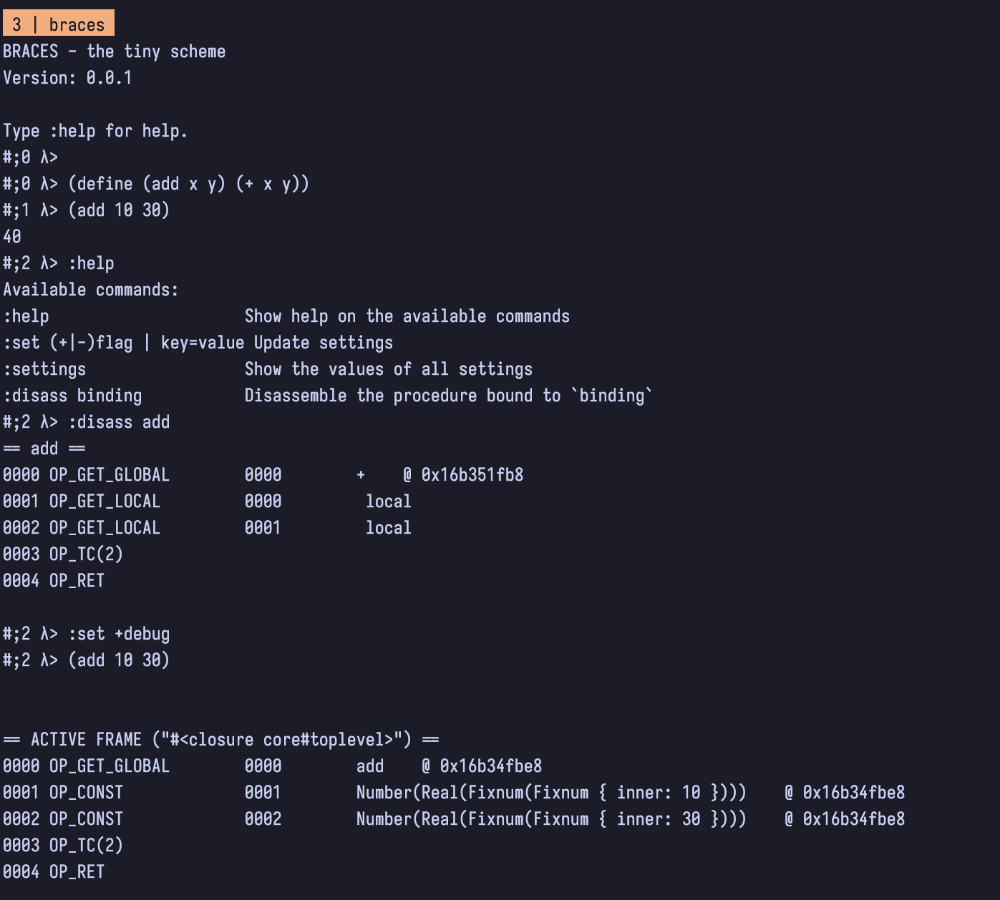

# Braces - compiler and virtual machine for a scheme dialect

 [certainty/braces][1]

Braces started when I worked with the wonderful book [crafting interpreters,][2] and I took that as an opportunity to:

1. learn rust
2. dive deeper into compilers and virtual machine implementations

I achieved both of these objectives and had a lot of fun working on this project. It implements a subset of [r7rs small][3] of the scheme programming language.
I chose a scheme mostly because its evaluation semantics are very simple, as is its syntax. I came, however to discover, that the meta-syntactic ability, *macros*, twist your compiler-builder-brain quite a bit. 
The implementation is incomplete, and I will probably not finish it, but I'm content with its current state as it works for quite some scenarios and implements non-trivial language features. Among them:

- Procedural macro expander
- Automatic tail call optimization
- Efficient implementation of closures

I'm sure there are also plenty of bugs in there, but that doesn't bother me at the moment. 

**Goals**

- Learn how to build a bigger project using the Rust programming language
- Learn how to build a compiler and virtual machine 

**Non-Goals**

- Build a full implementation of r7rs

**Decisions**

- Implement a subset of r7rs
- Implement the virtual machine as a stack machine 
- Don't implement continuations
- Implement procedural macros with explicit renaming

**Examples**

The following screenshot shows the braces REPL. It uses readline for completion and provides a way to tweak the level of introspection via flags. This example also shows the disassembler in action.

[1]:	https://github.com/certainty/braces
[2]:	https://craftinginterpreters.com/
[3]:	https://small.r7rs.org/
