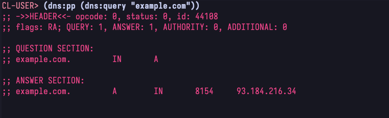

# [Implement DNS in a weekend in common lisp](https://github.com/certainty/cl-dns)

I had some time on my hand during a weekend and I have never built a DNS resolver before, so here is my version of [implementing DNS in a weekend][2].
This is a fun project because it's small in scope, yet the problem space is non-trivial. The main objective for me here was to learn more about the current state of common lisp and how to use its binary manipulation and networking capabilities. 

**Goals**

- Learn more about Common Lisp's socket implementation
- Learn more about Common Lisp's capabilities to parse binary data
- Understand in detail what a DNS resolver does 

**Non-Goals**

- Implement a full DNS resolver

**Decisions**

- Provide an API for IP resolution and 
- Provide an API to issue arbitrary DNS queries and display the result similar to the `dig` command

**Example**

[1]:	https://github.com/certainty/cl-dns
[2]:	https://implement-dns.wizardzines.com/

